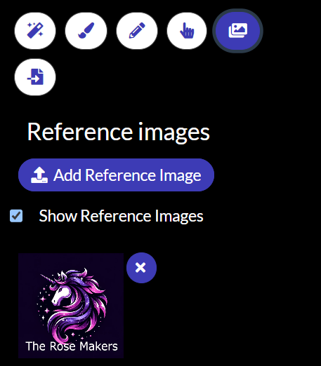

# AiBrush Local Editor

## Set up ComfyUI

If you're running windows, you can grab a standalone ComfyUI zip from https://github.com/comfyanonymous/ComfyUI/releases

Unzip that on your system and edit the `run_nvidia_gpu.bat` file as follows:

```bat
.\python_embeded\python.exe -s ComfyUI\main.py --windows-standalone-build --enable-cors-header=http://localhost:5173
```

## Models to Download

- The workflows included with this tool use [DreamshaperXL](https://civitai.com/models/112902/dreamshaper-xl). Download it into the `ComfyUI/models/checkpoints` folder.
- Download the [SDXL Inpainting](https://civitai.com/models/146028/sdxl-inpainting-01-official-reupload) model and place in the `ComfyUI/models/unet` folder.
- Download the [LCM&TurboMix LoRA](https://civitai.com/models/216190) model and place in the `ComfyUI/models/loras` folder.
- Download the VIT-H clipvision model from https://huggingface.co/h94/IP-Adapter/resolve/main/models/image_encoder/model.safetensors, rename to `ipadapter_clipvision_vith`, and place in `ComfyUI/models/clip_vision` folder.
- Download the SDXL IPAdapter model from https://huggingface.co/h94/IP-Adapter/resolve/main/sdxl_models/ip-adapter-plus_sdxl_vit-h.safetensors and place in `ComfyUI/models/ipadapter` folder.

## Flux Support
Follow instructions at https://comfyanonymous.github.io/ComfyUI_examples/flux/ to get flux working.
Use the smaller faster models here for a better experience: https://huggingface.co/Kijai/flux-fp8

## Custom Nodes

- Navigate to the `ComfyUI/custom_nodes` folder.

```shell
git clone https://github.com/Acly/comfyui-tooling-nodes
git clone https://github.com/cubiq/ComfyUI_IPAdapter_plus.git
```

## Running ComfyUI

Now you can start up ComfyUI by running `run_nvidia_gpu.bat`.

## Install dependencies

Make sure you have NodeJS and yarn installed.

Navigate to the root of this folder and install library dependencies:

```shell
yarn
```

Then to start up the UI:

```shell
yarn dev
```

Navigate to http://localhost:5173/ and you can use the editor.

## Reference Images



Reference images use [IPAdapter](https://github.com/cubiq/ComfyUI_IPAdapter_plus) to guide diffusion towards the style
and content of a given image. Please note that this takes up a lot of ram and may not work on your gpu.
